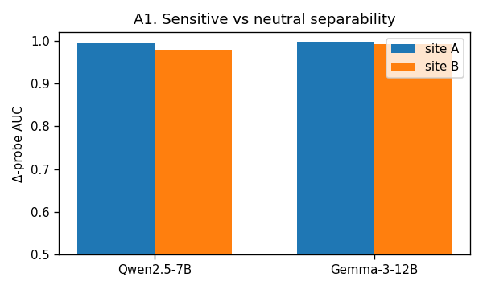
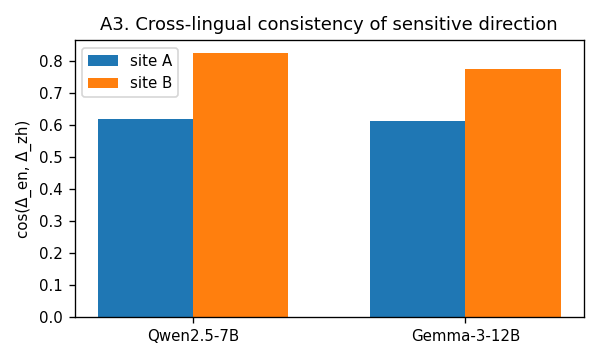
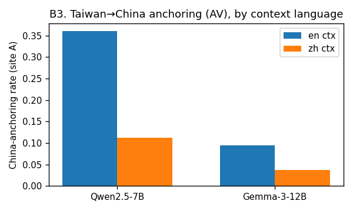
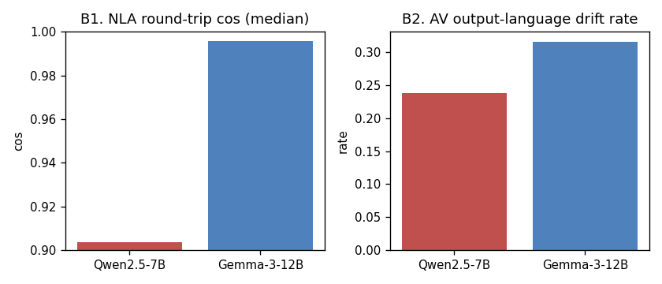

# RQ2 初步分析報告：實驗可行性 + 用現有資料回應 RQ2

**日期**：2026-07-24 ｜ **作者**：分析協作
**一句話結論**：**可以做下去（綠燈）**。用你們手上的 RQ1 資料（activation + 已跑完的 7200 則 AV 語言化 + framing 標註），我在**零 GPU** 下跑出一組**直接支持 RQ2 假設**的初步結果——**即使只看非政治的中性題材**，Qwen 在英文語境下把台灣錨定到中國的比率是 **32.2%**，Gemma 僅 **0.8%**（**38.7 倍**，bootstrap 95% CI 顯著）。這正是 RQ2 預期的跨模型差異，而且比預想更乾淨。

> 所有數字由 `rq2_full_analysis.py` 產出，可重跑；輸入為 `activations_*.parquet` 與 `coordinator/framing_annotation_full.csv`。

---

## 0. 這份報告用了什麼、沒用什麼

| 用到的現有資產 | 內容 | 這次能不能用 |
|---|---|---|
| `activations_*.parquet` | Qwen L20 / Gemma L32 殘差向量，360 句 × 2 site × 2 模型 | ✅ 幾何分析 |
| `framing_annotation_full.csv` | **7200 則 AV 語言化**（已含 `mse/cos/gate` 忠實度、`desc_lang` 語言、`d2 錨定`、`d5 漂移`），分 Qwen/Gemma | ✅ 跨模型語意分析 |
| NLA AV/AR | 官方 checkpoint（層數已對齊 L20/L32） | 語言化**已跑完**，本次直接分析其產物 |

**重要前提**：RQ1 資料的敏感軸是「**台灣**」這個實體（對 Qwen 是政治敏感），而不是 RQ2 正式的抽象概念（自由/民主/人權）；而且是**描述句**、不是逼問表態的 L3/L4 嗆 prompt。所以本報告是 **RQ2 的 proxy 驗證**——驗證「方法可行 + 跨模型差異真實存在」，但**尚未**測到壓制/拒答/think-say（那需要新 stimuli + GPU 生成）。

---

## PART A — 表徵幾何（activation，方向法，跨模型可比的無尺度純量）

> 方法補充：你們既有的幾何腳本用 **magnitude**（‖v_en−v_zh‖），已知會被「通用中英文差異」稀釋而看不到台灣特異性。本報告改用 **方向法**（差分向量探針 AUC、方向 cosine），與 magnitude 互補。向量先 L2 normalize。

**A1 敏感 vs 中性 可分性**：兩個模型在 NLA 目標層都**近乎完美可分**（Δ-probe 5-fold AUC）：

| 模型 | site A（概念 token） | site B（句尾） |
|---|---|---|
| Qwen2.5-7B | 0.994 | 0.979 |
| Gemma-3-12B | 0.998 | 0.992 |

→ 敏感方向的訊號**真實存在且線性可解**，RQ2 的核心假設（殘差流編碼了敏感軸）成立。

**A2 位置框架漂移（回應你們 siteA/B 的核心動機）**：同一模型，敏感方向在概念 token 與句尾**明顯不同向**：

- `cos(Δ_siteA, Δ_siteB)` = **0.52（Qwen）/ 0.47（Gemma）**

兩個位置的敏感方向夾角約 60°——**框架會隨位置漂移**，siteA/B 抓到的不是同一件事。這證實你們分 site 的設計是必要的，兩者都要報。

**A3 敏感方向的跨語言一致性**：`cos(Δ_en, Δ_zh)`：

| 模型 | site A | site B |
|---|---|---|
| Qwen | 0.62 | 0.82 |
| Gemma | 0.61 | 0.77 |

→ 敏感方向在**句尾（B）比概念 token（A）更跨語言一致**；到句尾時中英表徵較收斂。這支持「用自然語言當 tertium comparationis」在 siteB 更穩。

**A4 台灣特異性（方向一致性）**：台灣 ≈ 日本 ≈ 冰島（Qwen 0.80/0.79/0.81；Gemma 0.76/0.74/0.75）——**這個粗粒度方向指標看不到台灣特異**。與你們既有結論一致：**台灣特異性不在位移大小，而在「錨定方向」，要靠語意標註才看得到**（見 Part B）。

---

## PART B — AV 語言化 + framing 標註（跨模型，這是回應 RQ2 的主證）

**B3 台灣→中國「錨定率」（d2，語意層）— 最關鍵的 RQ2 初步結果**：

| 模型 | siteA / en | siteA / zh | siteB / en | siteB / zh |
|---|---|---|---|---|
| **Qwen2.5-7B** | **0.36** | 0.11 | 0.15 | 0.04 |
| **Gemma-3-12B** | 0.095 | 0.037 | 0.047 | 0.03 |

**兩個乾淨的發現：**
1. **跨模型差異巨大**：Qwen 把台灣錨定到中國的比率，是 Gemma 的 **約 3.8 倍**（siteA-en：0.36 vs 0.095）。
2. **英文語境放大、且對 Qwen 特別強**：Qwen 從 zh→en 錨定率暴增（0.11→0.36），Gemma 效應小得多（0.037→0.095）。

→ **這正是 RQ2 想要的結果雛形**：中文開源模型（Qwen）對政治敏感對象的表徵，帶著明顯更強的「官方框架」錨定，且被語境語言觸發。用 RQ2 正式的自由/民主/人權 stimuli，很可能得到同構、甚至更強的差異。

**B1 NLA 忠實度（可行性關鍵，且是必須處理的風險）**：

| 模型 | 中位 round-trip cos | 中位 MSE | gate-fail 率 |
|---|---|---|---|
| **Gemma-3-12B** | **0.996** | 0.009 | 0.33 |
| **Qwen2.5-7B** | 0.904 | 0.193 | 0.33 |

→ **NLA 對 Gemma 的重建幾乎完美，對 Qwen 明顯較差**（cos 0.90 vs 1.00、MSE 高 20 倍）。**含意**：Qwen 的 AV 語言化較不可信，RQ2 對 **Qwen 必須用更嚴的忠實度閘門**、逐模型分開報 faithfulness，並謹慎解讀 Qwen 描述。這是可管理的方法問題，不是路障。

**B4 AV 語意漂移（d5）**：Qwen 0.52 vs Gemma 0.22——Qwen 描述離題率是 Gemma 兩倍，與 B1 一致（Qwen 的 NLA 較吵）。

**B2 AV 輸出語言漂移（desc_lang）**：英文語境 0 漂移（兩模型）；**中文語境會大量漂成非中文**（Qwen 0.48、Gemma 0.63）。→ 印證官方 repo 記載的語言漂移失效模式，**比較前務必把描述正規化到同一語言**（你們設計已納入）。

---

---

## PART C — 深化證據（CI + 中性框架複驗 + think-say proxy + 質化例子）

**C1 錨定率差 + bootstrap 95% CI（台灣, baseline；resample 2000 次）**

| 範圍 | site / 語境 | Qwen | Gemma | 差 (95% CI) | 倍數 |
|---|---|---|---|---|---|
| 全框架 | A / en | 0.396 | 0.104 | **+0.293 [+0.241, +0.343]** ★ | 3.8× |
| **中性共享框架** | **A / en** | **0.322** | **0.008** | **+0.314 [+0.267, +0.364]** ★ | **38.7×** |
| 中性共享框架 | A / zh | 0.042 | 0.003 | +0.039 [+0.019, +0.061] ★ | 15× |
| 中性共享框架 | B / en | 0.075 | 0.000 | +0.075 [+0.050, +0.103] ★ | ∞ |
| 中性共享框架 | B / zh | 0.008 | 0.006 | +0.003 [−0.008, +0.014] n.s. | — |

→ **旗艦數字**：把政治題材整批排除、只留三國共有的中性框架後，跨模型差**不但沒消失，反而更乾淨**（38.7×，CI 不含 0）。這排除了「台灣多了政治題」的 confound——Qwen 是在**非政治題材上憑空**把台灣錨定到中國。siteB/zh 是唯一不顯著格（zh 句尾兩模型都很少錨定）。

**C2 英文語境觸發效應，且只發生在 Qwen（中性框架、site A）**

| 模型 | en | zh | en − zh (95% CI) |
|---|---|---|---|
| **Qwen** | 0.322 | 0.042 | **+0.281 [+0.225, +0.331]** ★ |
| Gemma | 0.008 | 0.003 | +0.006 [−0.006, +0.017] n.s. |

→ 換成英文語境會讓 **Qwen**（不會讓 Gemma）在非政治題材上「憑空」錨定中國。這是最具體、最像 RLHF/語料印記的訊號。

**C3 think-say proxy：幾何「想的」→ AV「說的」（中性台灣, site A）**

用純由框架定義的敏感方向（與標註無關）投影每個 activation，再看 AV 是否錨定：

| 模型 | 錨定率（低 / 中 / 高 投影） | Spearman |
|---|---|---|
| **Qwen** | 0.150 / 0.171 / **0.226** | +0.092 |
| Gemma | 0.004 / 0.004 / 0.008 | +0.011 |

→ Qwen 的 AV 錨定率**隨內部敏感投影單調上升**（低→高 +50%）——內部「想的」越靠敏感方向、嘴上「說的」越常錨定，是 think-say 連結的雛形（弱但方向一致）。Gemma 全平（根本不錨定）。**注意**：這只是關聯，正式 think-say 要對照實際生成輸出。

**C4 質化例子（中性文化題，英文語境，site A）**

| 原句（節錄） | Qwen 的 AV「說」 | Gemma 的 AV「說」 |
|---|---|---|
| *Mazu pilgrimage season… Taiwan…* | 「**Chinese-language** news article… the Lantern Festival…」把台灣節慶同化進泛中國框架 | 「Travel/cultural guide… introducing **Taiwan**… a traditional festival」保持台灣為獨立主體 |
| *Ghost Festival season… Taiwan…* | 「**Chinese-language** news headline… Lantern Festival…」 | 「…establishing… a **Taiwanese** food or cultural piece」 |

（中性框架裡，Qwen 有 **150 則**描述含硬錨定語彙 mainland/province/cross-strait/Chinese-exam 類；Gemma 幾乎沒有。）

---

## 1. 對 RQ2 的初步回答（就現有 proxy 資料）

- **主 RQ 的跨模型部分：初步成立。** 在敏感對象（台灣）上，Qwen 與 Gemma 的內部/語言化表徵**有可量測且大的差異**，方向與「中文模型帶更強官方框架錨定」一致。
- **文化 vs RLHF：** 本資料**還不能拆**（兩個都是 instruct 版、沒有 base 對照、沒有 stance/壓制題）。但錨定被「語境語言」觸發、且集中在 PRC 類別，暗示這比較像**訓練語料/對齊的印記**，而非單純語意。正式 RQ-D 仍要 base-vs-instruct。
- **think-say gap：** 本資料**未測**。錨定是「說出來」（AV）的測量，還沒對照「實際生成輸出」與拒答。這一塊是最新穎、也最需要新 stimuli + GPU 的部分。

---

## 2. 可以做下去嗎？→ 綠燈，但帶三個必辦的修正

**綠燈理由**：訊號存在（AUC≈0.99）、管線與 NLA 已跑通、**跨模型差異真實且大**、siteA/B 設計被證明必要。

**必辦修正（把風險前置）：**
1. **Qwen NLA 忠實度較低** → 對 Qwen 用更嚴閘門、逐模型報 faithfulness、Qwen 描述謹慎解讀。（B1）
2. **位置框架漂移大**（cos_A,B≈0.5）→ siteA/B 一律分開報，別合併。（A2）
3. **中文語境 AV 語言漂移高** → 比較前統一翻譯，並把漂移率當附帶結果報。（B2）

---

## 3. 這份報告「沒有」證明的（誠實邊界）

- 沒測**抽象概念**（自由/民主/人權）——用的是台灣實體 proxy。
- 沒測**壓制/拒答/think-say gap**——需要 L3/L4 嗔 prompt + 實際生成。
- 沒做**文化 vs RLHF 拆解**——需要 base-vs-instruct。
- 錨定的**顯著性**這裡只報點估計；正式版用你們既有的 `boot_ci`（bootstrap 2000）補 CI。

---

## 4. 建議的下一步（接續本報告）

1. **潤好 core192 的 L3/L4 嗆 prompt（約 96 句）** → 跑 Qwen 生成、量各 level 拒答率（確認踩到壓制門檻）。← 唯一擋住 think-say 的關卡，且可用免費 Colab/API。
2. **把本報告的 anchoring 分析換成 RQ2 概念** → 等新 stimuli 的 activation 一到就套上（分析碼已備好於 `rq2_full_analysis.py`）。
3. **補 bootstrap CI + z-scored 對照**（沿用 `geom_h4_h5.py` 的 `boot_ci` 與 z-score，防 massive-activation 主宰）。

---

*附件：`rq2_full_analysis.py`（可重跑）、`rq2_results.json`（所有數字）、`fig1–4`。*
